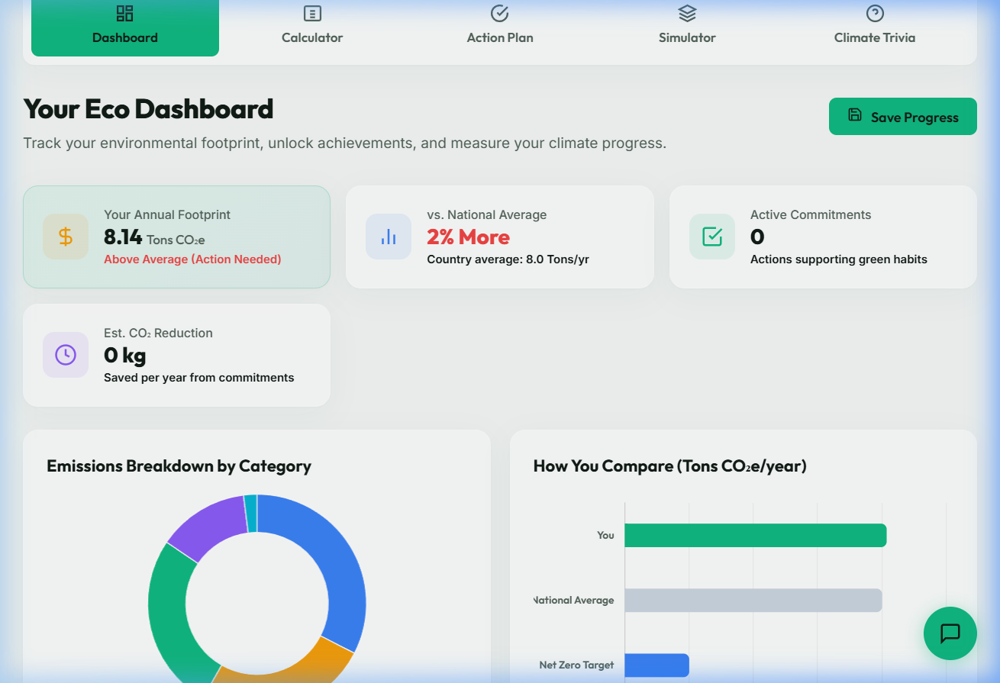
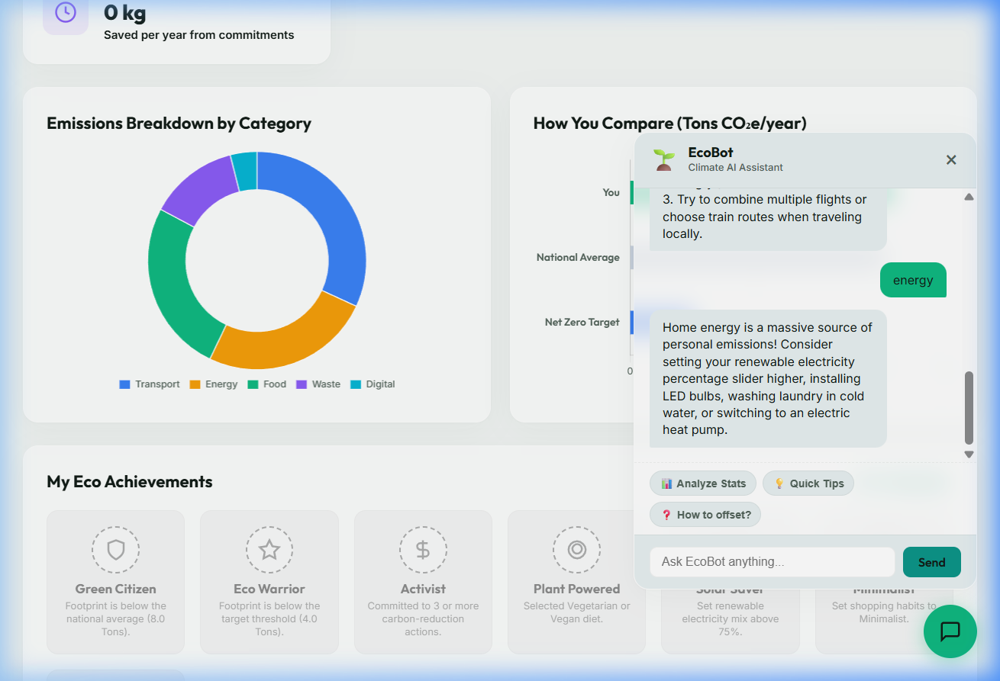

# EcoTrace 🌱 | Carbon Footprint Awareness Platform

**EcoTrace** is a premium, client-side, interactive Single-Page Application (SPA) designed to help individuals calculate, track, visualize, and reduce their carbon footprint. 

With advanced carbon visualization charts, a gamified badge reward system, a personalized habit checklist, an interactive "What-If" sandbox simulator, a simulated Website Carbon Analyzer, and an intelligent EcoBot climate chatbot, EcoTrace turns sustainability tracking into an engaging, gamified experience.

---

## 📸 Media Walkthrough

### 1. Interactive Application Walkthrough
Observe the wizard calculation updates, simulator tree plotter, and chatbot responses in the animation below:


### 2. Main Dashboard & Emissions Chart
The visual dashboard renders a doughnut category distribution and comparative bar graph using Chart.js:



### 3. Floating EcoBot AI Assistant Chatbot
EcoBot parses the user's active calculator emissions to offer targeted tips:



---

## ⚡ Key Features

1. **Step-by-Step Carbon Calculator Wizard**: Detailed inputs across 5 categories: Transportation, Home Energy, Food & Diet, Lifestyle & Waste, and Digital Carbon.
2. **Interactive Visual Dashboard**: Instant feedback using Chart.js doughnut and horizontal comparison bars.
3. **Achievements & Badges**: 7 unlockable badges (e.g., *Green Citizen*, *Eco Warrior*, *Solar Saver*, *Trivia Scholar*) that dynamically highlight on completion.
4. **Action Planner & Weekly Habits**: Committable reduction habits linked to a progress bar checklist to measure annual CO₂ offset.
5. **What-If Sandbox Simulator**: Toggles for systemic adjustments (solar panels, EV, plant-based diet) that render visual tree growth plots (1 tree absorbs 22 kg CO₂/yr).
6. **Website Carbon Checker**: Simulates auditing web page URL resource payloads and yields an Eco Grade (A+ to F).
7. **EcoBot Climate Chatbot**: A floating assistant that inspects your actual statistics to suggest context-rich tips and answers general environmental questions.

---

## 🧪 Scientific Calculation Model

Emissions are estimated using standardized greenhouse gas coefficients (EPA and DEFRA):

| Sector | Parameter / Action | Coefficient Applied |
| :--- | :--- | :--- |
| **Transportation** | Gasoline Car | $0.18\text{ kg CO}_2 / \text{km}$ |
| | Diesel Car | $0.17\text{ kg CO}_2 / \text{km}$ |
| | Hybrid / Plug-in | $0.10\text{ kg CO}_2 / \text{km}$ |
| | Electric Vehicle (EV) | $0.04\text{ kg CO}_2 / \text{km}$ (grid electricity load) |
| | Public Transit (Bus/Train) | $0.0624\text{ Tons CO}_2 / \text{weekly hour per year}$ |
| | Short Flights ($< 3\text{ hrs}$) | $0.15\text{ Tons CO}_2 / \text{flight}$ |
| | Long Flights ($> 3\text{ hrs}$) | $0.80\text{ Tons CO}_2 / \text{flight}$ |
| **Home Energy** | Grid Electricity | $0.35\text{ kg CO}_2 / \text{kWh}$ (adjusted by Clean Mix%) |
| | Natural Gas Heating | $0.00020\text{ Tons CO}_2 / \text{kWh}$ |
| | Heating Oil | $0.00027\text{ Tons CO}_2 / \text{kWh}$ |
| | Biomass (Wood Pellets) | $0.00003\text{ Tons CO}_2 / \text{kWh}$ |
| **Food & Diet** | Heavy Meat Eater | $3.2\text{ Tons CO}_2 / \text{year}$ baseline |
| | Average Meat Eater | $2.2\text{ Tons CO}_2 / \text{year}$ baseline |
| | Vegetarian | $1.5\text{ Tons CO}_2 / \text{year}$ baseline |
| | Vegan | $0.9\text{ Tons CO}_2 / \text{year}$ baseline |
| | Local Sourcing Ratio | Up to $15\%$ diet offset discount |
| | Food Waste Behavior | Minimal ($0\text{ t}$), Moderate ($0.15\text{ t}$), High ($0.40\text{ t}$) penalties |
| **Lifestyle & Waste**| Minimalist Shopping | $0.3\text{ Tons CO}_2 / \text{year}$ baseline |
| | Average Shopping | $0.8\text{ Tons CO}_2 / \text{year}$ baseline |
| | Consumerist Shopping | $2.2\text{ Tons CO}_2 / \text{year}$ baseline |
| | Recycling Credits | Paper ($-0.08\text{ t}$), Plastic ($-0.12\text{ t}$), Glass ($-0.06\text{ t}$), Metal ($-0.09\text{ t}$) |
| **Digital Carbon** | Video Streaming | $0.18\text{ kg CO}_2 / \text{hour}$ |
| | Video Calls | $0.12\text{ kg CO}_2 / \text{hour}$ |
| | Scrolling & Gaming | $0.05\text{ kg CO}_2 / \text{hour}$ |

---

## 🚀 Getting Started

EcoTrace operates as a dynamic full-stack Node.js application to securely handle Google Gemini AI API requests and Website Carbon Header Audits. 

### Prerequisites
- [Node.js](https://nodejs.org/) (v18+ recommended)
- A Google Gemini API Key (Optional, required for live AI chatbot features. Without it, the chatbot falls back to local rules).

### Running Locally
1. Clone the repository and navigate into the project folder.
2. Install the required backend dependencies:
   ```bash
   npm install
   ```
3. (Optional) Create a `.env` file in the root directory and add your Gemini API Key:
   ```env
   GEMINI_API_KEY=your_gemini_api_key_here
   ```
4. Boot the Express local server:
   ```bash
   npm run dev
   ```
5. Access the web application at: `http://localhost:3000`

### Running via Docker
1. Build the Node.js Docker container:
   ```bash
   docker build -t ecotrace .
   ```
2. Run the container (pass your API key as an environment variable):
   ```bash
   docker run -d -p 3000:3000 -e GEMINI_API_KEY=your_gemini_api_key_here ecotrace
   ```
3. Open `http://localhost:3000` in your web browser.

---

## 🔮 Future Scope

As EcoTrace scales, several exciting features are planned for future releases to enhance personal carbon tracking and community engagement:

1. **User Authentication & Cloud Sync**: Allow users to create accounts to securely save their footprint history, badge progress, and committed habits across multiple devices over time.
2. **Global Leaderboards & Social Challenges**: Introduce competitive community elements where users can join sustainability challenges, form teams with friends, and view global leaderboards.
3. **IoT Integration (Smart Home/EV)**: Connect directly with smart home energy monitors (e.g., Google Nest) and EV telemetry APIs to pull live, automated electricity usage and driving statistics rather than relying on manual input.
4. **Carbon Offset Marketplace**: Provide direct, vetted links to certified carbon offset programs (reforestation, clean energy initiatives) where users can seamlessly purchase credits to directly neutralize their remaining footprint.
5. **Multi-Language & Regional Localization**: Expand the Gemini AI chatbot and UI to support multiple languages alongside region-specific grid carbon conversion coefficients for pinpoint global accuracy.

---

## 📄 License

This project is licensed under the MIT License - see the [LICENSE](LICENSE) file for details.
