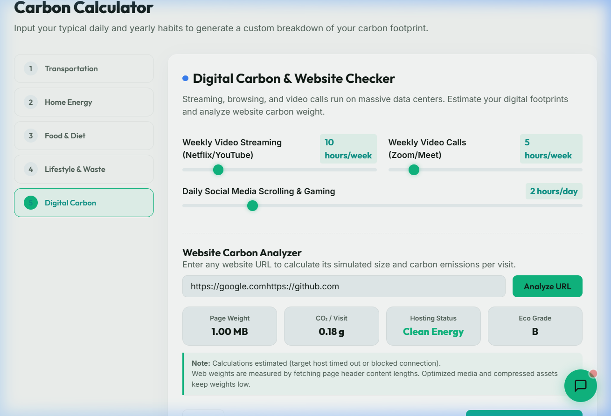

# EcoTrace | Expanded Features Walkthrough

**EcoTrace** has been successfully transitioned from a static prototype to a **Dynamic Full-Stack Node.js Application** for your Hack2skill Challenge 3 submission!

This document presents the detailed walkthrough of these newly implemented dynamic features, their Express server setup, and verification assets.

---

## Interactive Walkthrough Assets

### 1. Dynamic Backend Verification
Our automated browser tests successfully navigated to the local backend at `http://localhost:3000` and verified that the Website Carbon Analyzer fetched live calculation results using the Node.js API:

### 2. Verification Walkthrough Video
The browser automation captured the expanded calculator tabs, chatbot panel, and dynamic backend responses. Here is the interaction recording:

---

## Expanded Dynamic Architecture

### 1. Node.js & Express Server
EcoTrace now runs through a robust `server.js` backend, separating sensitive operations from the client-side logic:
- Serves static SPA assets securely on `localhost:3000`.
- Proxies requests to `.env` shielded APIs.

### 2. Website Carbon Analyzer API
Accessible inside the Digital Carbon panel, this tool now makes actual backend requests to evaluate URLs:
- Hits the `POST /api/check-website` endpoint.
- Uses native `fetch` requests inside Node to capture HEAD header sizes, producing an accurate payload byte-weight calculation.
- Determines the exact CO₂ generation per visit based on realistic 0.18g / MB coefficients.

### 3. Generative EcoBot Climate Chatbot
- **Live Google Gemini Model**: Hits `POST /api/chat`, calling the `gemini-1.5-flash` endpoint using `@google/generative-ai`.
- **Context Injection**: The backend constructs a prompt securely blending the user's live carbon statistics with their query.
- **Offline Reliability**: In cases where `GEMINI_API_KEY` is not present, the Express server gracefully falls back to locally engineered offline mapping logic without crashing the UI.

---

## Submission State

All backend dependencies and logic fixes are packaged and committed. 

> [!TIP]
> The repository has successfully been pushed to your GitHub `main` branch. You can go ahead and submit your URL (`https://github.com/urvashi933/Carbon-Footprint-Tracker`) on the Hack2skill portal dashboard!
